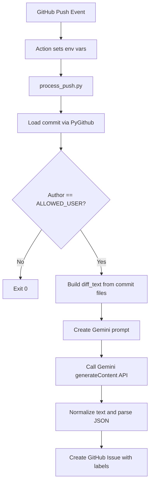

# Push-to-Issue AI Logger

A GitHub Actions-driven logging automation that analyzes each trusted commit with Gemini and opens a structured GitHub Issue summarizing code changes, labels, and potential security risks.

[](LICENSE)
[](https://www.python.org/)
[](https://github.com/features/actions)
[](https://ai.google.dev/)

> [!IMPORTANT]
> This repository is intended to run inside GitHub Actions with a valid `GITHUB_TOKEN` context and configured secrets/variables. Running it locally without those values will fail.

## Table of Contents

- [Features](#features)
- [Tech Stack & Architecture](#tech-stack--architecture)
- [Getting Started](#getting-started)
- [Testing](#testing)
- [Deployment](#deployment)
- [Usage](#usage)
- [Configuration](#configuration)
- [License](#license)
- [Support the Project](#support-the-project)

## Features

- Event-driven commit analysis workflow suitable for audit-style logging.
- Automatic commit diff extraction and prompt generation from changed files.
- Trusted-author gate (`ALLOWED_USER`) to ignore untrusted pushes.
- Structured LLM response contract using strict JSON keys:
  - `issue_title`
  - `issue_body`
  - `labels`
- Automatic issue creation in the same repository using GitHub API.
- Built-in prompt instruction to perform a basic security review of changed code.
- Automatic diff truncation guard (`~100k chars`) to reduce prompt overflow risk.
- Markdown code-fence cleanup before JSON parsing to handle model formatting drift.
- Compatible with standard GitHub labels plus optional `security` when risk is detected.

> [!NOTE]
> The current script performs no retry/backoff logic for Gemini or GitHub API calls; for production-grade reliability, add retries and response validation guards.

## Tech Stack & Architecture

### Core Stack

- **Language:** Python
- **Primary Runtime Dependency:** `requests`
- **GitHub Integration:** `PyGithub` (`from github import Github, Auth`)
- **LLM Provider:** Google Gemini API (`gemini-2.5-flash` endpoint)
- **Execution Environment:** GitHub Actions runner

### Project Structure

```text
.
├── LICENSE
├── README.md
└── process_push.py
```

### Key Design Decisions

- **Single-file orchestration (`process_push.py`):** keeps CI wiring minimal and transparent.
- **Environment-only configuration:** avoids hardcoded credentials and supports secret injection in CI.
- **Author allowlist gate:** reduces abuse potential by only processing commits from a specific user.
- **Prompt-defined output schema:** enforces predictable JSON for issue title/body/labels.
- **In-prompt security review:** blends changelog generation with lightweight vulnerability triage.

### Data Flow



> [!TIP]
> If you expect very large commits, split prompt generation by file batches and merge model outputs before creating a single issue.

## Getting Started

### Prerequisites

- Python `3.10+`
- A GitHub repository with Actions enabled
- A Gemini API key
- Repository permissions that allow issue creation via `GITHUB_TOKEN`

### Installation

```bash
git clone https://github.com/<your-org>/Push-issues-github-actions-gemeniAI.git
cd Push-issues-github-actions-gemeniAI
python -m venv .venv
source .venv/bin/activate  # Windows: .venv\Scripts\activate
pip install --upgrade pip
pip install requests PyGithub
```

> [!NOTE]
> This repository does not currently ship a `requirements.txt`. Pin and lock dependency versions for reproducible CI behavior.

## Testing

Because this project is CI/event-driven, use layered validation:

### 1) Static Syntax Check

```bash
python -m py_compile process_push.py
```

### 2) Optional Linting

```bash
pip install ruff
ruff check process_push.py
```

### 3) Dry-Run Style Execution (Local)

Set environment variables and run manually:

```bash
export GITHUB_TOKEN="ghp_xxx"
export GEMINI_API_KEY="AIza..."
export REPOSITORY="owner/repo"
export COMMIT_SHA="<commit_sha>"
export ALLOWED_USER="trusted-username"
python process_push.py
```

> [!WARNING]
> Local execution can create real GitHub Issues in your target repository. Prefer a sandbox repo for validation.

## Deployment

Use GitHub Actions as the production runtime.

### Recommended CI/CD Integration Pattern

1. Trigger on `push` events.
2. Pass required context/env values to `process_push.py`.
3. Store secrets and variables in repository settings.
4. Restrict token permissions to least privilege.

Example deployment checklist:

- Set repository **secret**:
  - `GEMINI_API_KEY`
- Set repository **variable** (or secret, if preferred):
  - `ALLOWED_USER`
- Ensure runtime env exports:
  - `GITHUB_TOKEN`
  - `REPOSITORY`
  - `COMMIT_SHA`

> [!CAUTION]
> If `ALLOWED_USER` is missing, the script calls `.strip()` on `None` and crashes. Define this variable unconditionally in workflow configuration.

## Usage

### Basic Execution Contract

The script reads runtime context from environment variables, fetches commit diffs, prompts Gemini, then opens an issue.

```python
# process_push.py (conceptual usage flow)
# 1) Pull credentials and metadata from env
# 2) Load commit data from GitHub API
# 3) Build prompt with commit message + patches
# 4) Submit to Gemini model
# 5) Parse strict JSON and create issue
```

### Expected AI Output Schema

```json
{
  "issue_title": "Refactor logging transport initialization",
  "issue_body": "Detailed summary of changed files, rationale, and security note if needed.",
  "labels": ["enhancement", "security"]
}
```

### Practical Behavior Notes

- Commits from users other than `ALLOWED_USER` are ignored with successful exit.
- Large diffs are truncated before sending to Gemini.
- The final issue body appends a footer with the short commit SHA.

## Configuration

### Environment Variables

| Name | Required | Description |
|---|---|---|
| `GITHUB_TOKEN` | Yes | GitHub token used by `PyGithub` for repository access and issue creation. |
| `GEMINI_API_KEY` | Yes | API key for Gemini `generateContent` endpoint. |
| `REPOSITORY` | Yes | Repository in `owner/name` format. |
| `COMMIT_SHA` | Yes | Full commit SHA that will be inspected. |
| `ALLOWED_USER` | Yes | Lowercased/trimmed GitHub username allowed to trigger issue generation. |

### GitHub Repository Settings

As originally documented in this project:

- `Settings -> Secrets and variables -> Actions`
  - `GEMINI_API_KEY`
  - `ALLOWED_USER`

### Runtime Flags and Files

- No CLI flags are currently implemented.
- No `.env` loader is built in; values must be exported by shell or workflow.
- No dedicated config file exists yet (all configuration is env-driven).

> [!TIP]
> If you need multi-environment setups (dev/stage/prod), introduce a small config layer that maps workflow inputs into environment profiles.

## License

This project is licensed under the **GNU Affero General Public License v3.0**. See [LICENSE](LICENSE) for the full legal text.

## Support the Project

[](https://www.patreon.com/OstinFCT)
[](https://ko-fi.com/fctostin)
[](https://boosty.to/ostinfct)
[](https://www.youtube.com/@FCT-Ostin)
[](https://t.me/FCTostin)

If you find this tool useful, consider leaving a star on GitHub or supporting the author directly.
